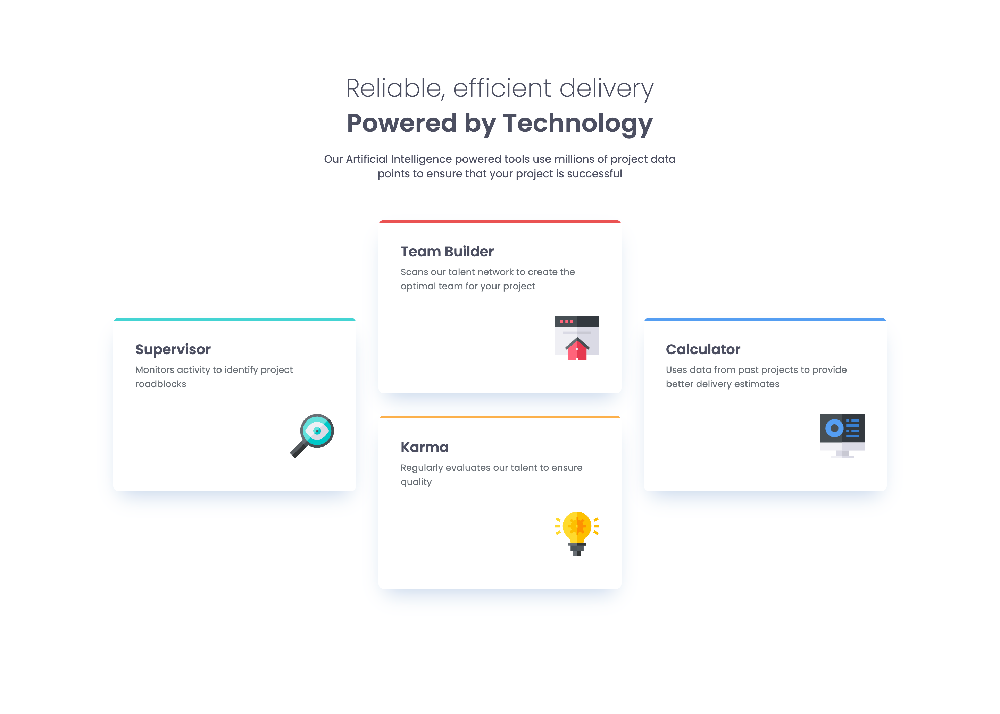

# Frontend Mentor - Four Card Feature Section

This is a solution to the [Four card feature section challenge on Frontend Mentor](https://www.frontendmentor.io/challenges/four-card-feature-section-weK1eFYK).

## Table of Contents

- [Overview](#overview)
  - [The Challenge](#the-challenge)
  - [Features](#features)
- [My Process](#my-process)
  - [Built With](#built-with)
  - [What I Learned](#what-i-learned)
  - [Useful Resources](#useful-resources)
- [Author](#author)

## Overview

This project is a responsive four-card feature section showcasing four main services: Supervisor, Team Builder, Karma, and Calculator. Each card highlights a different aspect of an AI-powered tool for project management.

### Screenshot



### Links

- Solution URL: [Github repository](https://github.com/jorgeLRM/four-card-feature-section)
- Live Site URL: [Live demo](https://jorgelrm.github.io/four-card-feature-section/)

### The Challenge

Users should be able to:

- View the optimal layout for the site depending on their device's screen size (mobile, tablet, and desktop)
- See interactive hover/focus states on interactive elements

### Features

- **Four service cards**: Supervisor (cyan), Team Builder (red), Karma (orange), and Calculator (blue)
- **Responsive design** with three breakpoints (mobile, tablet 768px, desktop 1440px)
- **Grid layout**: 
  - Mobile: 1 column
  - Tablet: 2 columns with specific ordering
  - Desktop: 3 columns in an inverted pyramid pattern
- **Color decorators**: 4px colored line at the top of each card
- **SVG icons** for each service
- **Subtle shadow** for visual depth

## My Process

### Built With

- **Semantic HTML5 markup**: Using `<header>`, `<main>`, and `<article>` tags for clear structure
- **CSS custom properties** (CSS variables)
  - Definition of corporate colors: Cyan, Red, Orange, and Blue
  - Definition of grays and white for typography and backgrounds
- **CSS Grid**: Implementation of responsive grids with `grid-template-columns` and `grid-template-rows`
- **Flexbox**: For alignment and spacing within cards and header
- **Typography**: Poppins font (weights: 200, 400, 600) from Google Fonts
- **Mobile-first design**: Starting with a single-column layout and expanding on larger screens
- **Media Queries**: Three breakpoints for optimal responsiveness

### What I Learned

During this project, I reinforced my knowledge on:

1. **Advanced CSS Grid**: Element positioning using `grid-column` and `grid-row`, especially for creating complex patterns across different resolutions

```css
/* Desktop pattern: inverted pyramid */
.card--supervisor {
  grid-column: 1 / 2;
  grid-row: 1 / 3;
}

.card--team-builder {
  grid-column: 2 / 3;
  grid-row: 1 / 2;
}

.card--calculator {
  grid-column: 3 / 4;
  grid-row: 1 / 3;
}
```

2. **Pseudo-elements**: Using `::before` to create decorators without adding extra HTML elements

```css
.card--decorator::before {
  content: '';
  position: absolute;
  height: 0.4rem;
  width: 100%;
}
```

3. **CSS Variables**: Centralized management of colors and reusable values

```css
:root {
  --cyan: hsl(180, 62%, 55%);
  --red: hsl(0, 78%, 62%);
  --orange: hsl(34, 97%, 64%);
  --blue: hsl(212, 86%, 64%);
}
```

4. **Visual effects and shadows**: Implementation of subtle shadows for depth

```css
box-shadow: 0px 15px 30px -11px rgba(131, 166, 210, 0.5);
```

### Useful Resources

- [MDN - CSS Grid](https://developer.mozilla.org/en-US/docs/Web/CSS/CSS_Grid_Layout) - Complete documentation on Grid
- [CSS Tricks - Grid Guide](https://css-tricks.com/snippets/css/complete-guide-grid/) - Visual and practical guide
- [Google Fonts](https://fonts.google.com/) - Free font library
- [Frontend Mentor](https://www.frontendmentor.io/) - Platform to improve skills with real-world challenges

## Author

- Frontend Mentor - [@jorgeLRM](https://www.frontendmentor.io/profile/jorgeLRM)
- GitHub - [@jorgeLRM](https://github.com/jorgeLRM)

---

**Challenge completed as part of Frontend Mentor learning exercises.**
